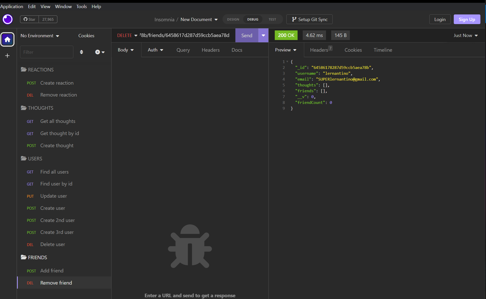
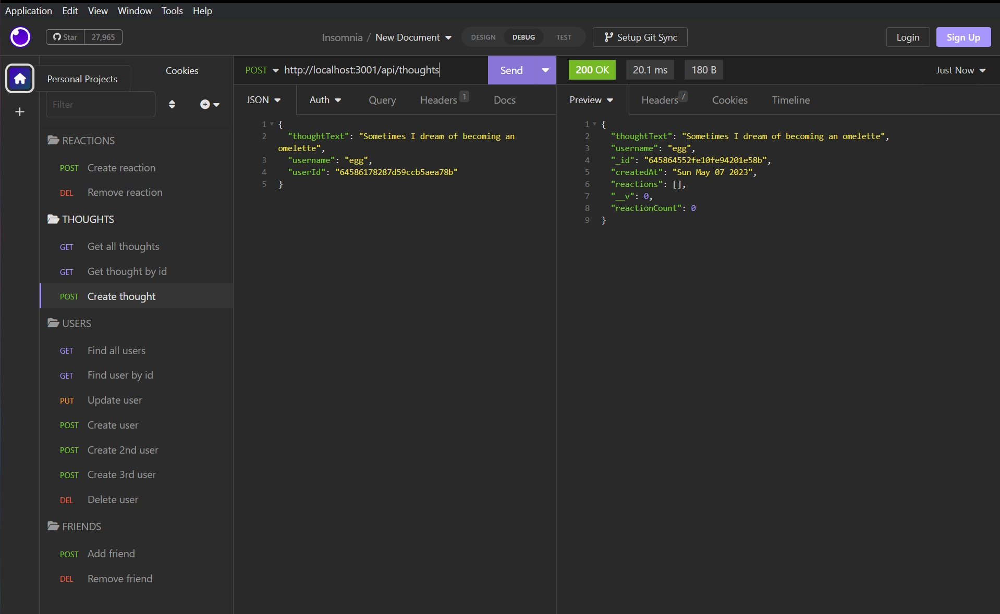
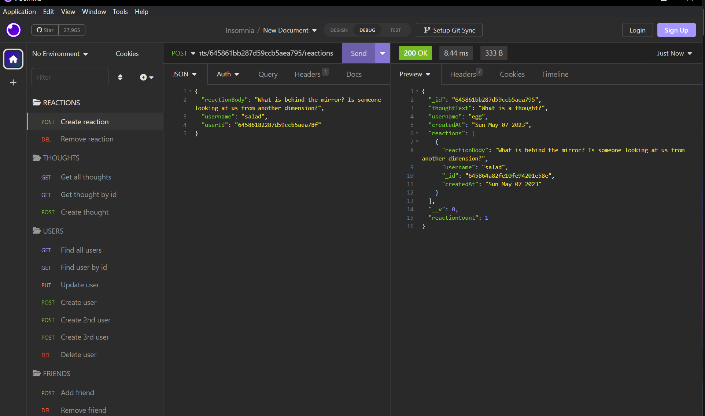

[](https://opensource.org/licenses/MIT)

# Social-web-API
Module 18: NoSQL-Social Network API

## Table of Contents:
- [Description](#Description)
- [Acceptance Criteria](#Acceptance-Criteria)
- [Installation](#Installation)
- [Tests](#Tests)
- [Walkthrough Video](#Walkthrough-Video)
- [License](#License)
- [Contact](#Contact)

## Description

##  Acceptance Criteria

- GIVEN a social network API
- WHEN I enter the command to invoke the application
- THEN my server is started and the Mongoose models are synced to the MongoDB database
- WHEN I open API GET routes in Insomnia for users and thoughts
- THEN the data for each of these routes is displayed in a formatted JSON
- WHEN I test API POST, PUT, and DELETE routes in Insomnia
- THEN I am able to successfully create, update, and delete users and thoughts in my database
- WHEN I test API POST and DELETE routes in Insomnia
- THEN I am able to successfully create and delete reactions to thoughts and add and remove friends to a user’s friend list

## Installation

1. Clone the repository
2. Ensure you have mongoDB installed. Have Insomnia installed as well for ease.
2. Within the terminal, run `npm install` if the package.json file is present.
3. If the package.json file is not present, run the following commands:
- npm init -y
- npm install express
- npm install mongoose
4. Start the server using `npm start`
5. Open Insomnia and enter the localhost url to test api routes

## Tests
Testing API calls using Insomnia


**`/api/users`**

* `GET` all users
* `POST` a new user
    ```json
    // example data
    {
        "username": "lernantino",
        "email": "lernantino@gmail.com"
    }
    ```

**`/api/users/:userid`**
* `GET` a single user by their`_id` 
* `PUT` to update a user's info by their `_id`
* `DELETE` to remove user by their`_id`

**`/api/users/:userId/friends/:friendId`**

* `POST` to add a new friend for the selected user
* `DELETE` to remove a friend from the selected user

**`/api/thoughts`** 

* `GET` to get all thoughts
* `POST` to create a new thought
    ```json
    // example data
    {
    "thoughtText": "Here's a cool thought...",
    "username": "lernantino",
    "userId": "5edff358a0fcb779aa7b118b"
    }
    ```

**`/api/thoughts/:thoughtId`**
* `GET` to get a single thought by `_id`
* `PUT` to update a thought by `_id`
* `DELETE` to remove a thought by `_id`


**`/api/thoughts/:thoughtId/reactions`**

* `POST` to create a reaction 
    ```json
    // example data
    {
    "reactionBody":"Why is the sky blue?",
    "username":"lernantino"
    }
    ```

**`/api/thoughts/:thoughtId/reactions/:reactionId`**
* `DELETE` remove a reaction by its `reactionId` 

## Walkthrough Video
[All Routes Walkthrough](https://watch.screencastify.com/v/rgaHD7TwvDozJzFv2qRj)

## License
Licensed under [MIT](https://choosealicense.com/licenses/mit/) license.

## Credits 
Thank you to AskBCS specifically Jaytee for helping with my reaction code issues! 

## Contact
[Terri Mack](https://github.com/terrinmack?tab=repositories)


